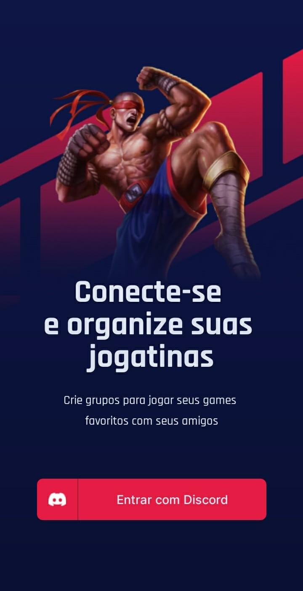
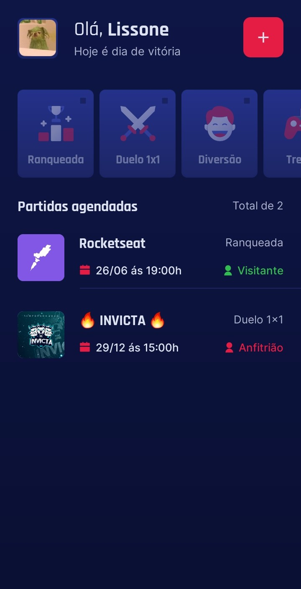
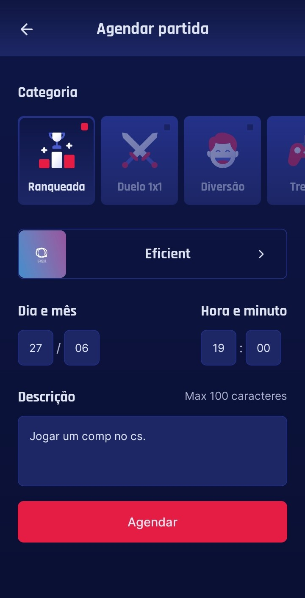

<h1 align="center">
  
</h1>

<p align="center">
  <a href="#description">Description</a>&nbsp;&nbsp;&nbsp;|&nbsp;&nbsp;&nbsp;
  <a href="#requirements">Requirements</a>&nbsp;&nbsp;&nbsp;|&nbsp;&nbsp;&nbsp;
  <a href="#technologies">Technologies</a>&nbsp;&nbsp;&nbsp;|&nbsp;&nbsp;&nbsp;
  <a href="#layout">Layout</a>&nbsp;&nbsp;&nbsp;|&nbsp;&nbsp;&nbsp;
  <a href="#usage">Usage</a>&nbsp;&nbsp;&nbsp;|&nbsp;&nbsp;&nbsp;
  <a href="#demonstration">Demonstration</a>
</p>
<br />
<p align="center">
  
  
  
  
  
  
  
</p>

<p align="center">
  <a href="https://github.com/Lissone/gameplay/issues">Report bug</a>
  ·
  <a href="https://github.com/Lissone/gameplay/issues">Request feature</a>
</p>

<br />

## Description

Mobile application with the aim of making appointments for online matches with your friends. With OAuth2 integration with the discord api and database with async storage, to save user data and schedules.

First time I develop a mobile app with react native and its technologies. Powered by NLW 6 Together marathon, taught by Rodrigo, Educator  of rocketseat from April 20th to 27th, 2021.

## Requirements

- [Nodejs](https://nodejs.org/en/)
- [Npm](https://www.npmjs.com/)
- [Expo](https://docs.expo.io/)
- [Yarn](https://yarnpkg.com/)

## Technologies

- ReactNative
- Expo
- Typescript
- StyleSheet
- AsyncStorage
- OAuth2 (Discord api)

## Layout

You can view the project layout via this <a href="https://www.figma.com/file/KCohZngN3UX60qgdvekLGK/GamePlay-NLW-Together?node-id=58913%3A83" target="_blank">link</a>.

## Usage

You can clone it on your pc using the command:

```bash
git clone https://github.com/Lissone/gameplay.git
cd gameplay
```

Install dependencies using:

```bash
yarn
#or
npm install
#or
expo install
```

Run project:

```bash
yarn start
#or
npm run start
#or
expo start
```

## Demonstration

<table>
  <tr>
    <th>Login</th>
    <th>Dashboard</th>
    <th>Create appointment</th>
  </tr>
  <tr>
    <td>
      
    </td>
    <td>
      
    </td>
    <td>
      
    </td>
  </tr>
</table>


## License

Distributed under the MIT License. See `LICENSE` for more information.

<h4 align="center">
  Made with ❤️ by <a href="https://github.com/Lissone" target="_blank">Lissone</a>
</h4>

<hr />
